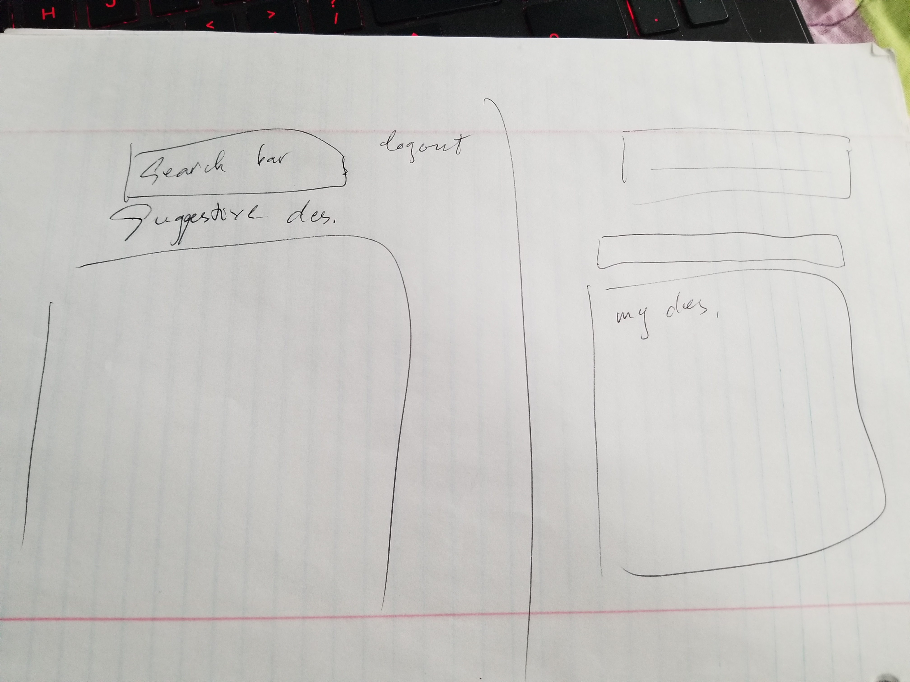
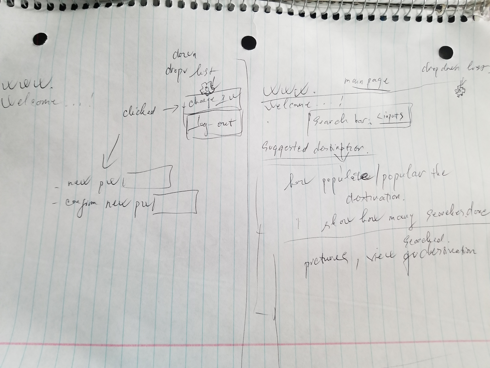

# project 2 front-end using Javascript

## Github links:

Back-end repo: https://github.com/TN-space/Project2-api \
Deploy site: https://project-no2.herokuapp.com/destinations \
Front-end repo: https://github.com/TN-space/Project2-front \
Deploy site:https://tn-space.github.io/Project2-front

## Planning:

### Userstories:

As a user want to be able to sign up.\
As a user want to be able to sign in.\
As a signed-in user want to be able to change password.\
As a signed-in user want to be able to sign out.\
As a signed-in user want to be able to create new destination.\
As a signed-in user want to be able to see all destinations.\
As a signed-in user want to be able to delete my destination.\
As a signed-in user want to be able to edit my destination.

### Technologies used:
HTML, scss, jquery, ajax, javascript

### Improvement:
Add a search button. \
After clicking search: \
  - How many people also searched for the same destinations. \
  - Heave reviews, add pictures, videos of the destinations. \
  - See pictures, videos, reviews of the destinations. \
After signed in, I want to see suggested/popular or last searched destinations.

### Image:

#### Wireframe:
 \
 \

